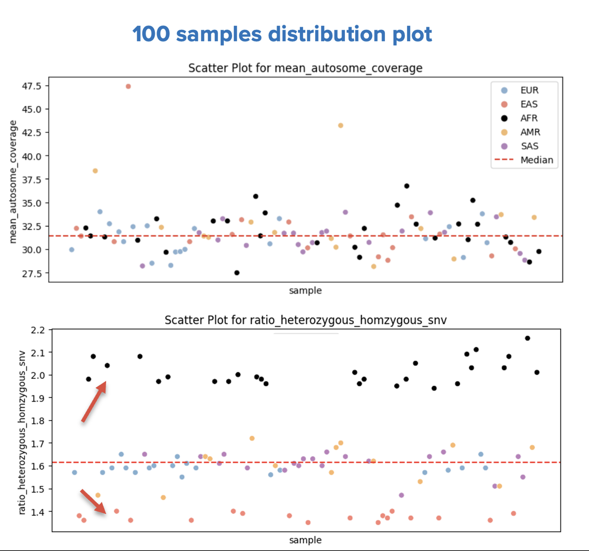

  <h1 style="font-size: 2rem; font-weight: normal; color: #888888; margin: 0;">
    <a href="https://github.com/ga4gh/quality-control-wgs" style="color: inherit; text-decoration: none;">
      GA4GH WGS Quality Control Standards
    </a>
  </h1>
  

 

# Benchmarking Resources

The benchmarking resources provided here are designed to ensure consistency, reliability, and transparency in the evaluation of Whole Genome Sequencing (WGS) Quality Control (QC) tools.

These resources serve multiple key purposes:

- They act as a standardized set of "unit tests" for validating reference implementation tools verifying correct input handling, output formatting, and generation of functionally equivalent QC metrics.

- They support the evaluation of implementation quality and performance by benchmarking computational efficiency, including runtime and memory usage.

To assist with result interpretation, we also provide an interactive [Jupyter Notebook](https://github.com/ga4gh/quality-control-wgs/blob/main/benchmark_resources/stats/Metrics_distribution.ipynb) that visualizes metric distributions across these samples. This enables users to explore how QC metrics vary at the population level and supports comparative analysis.

**Example:** 

